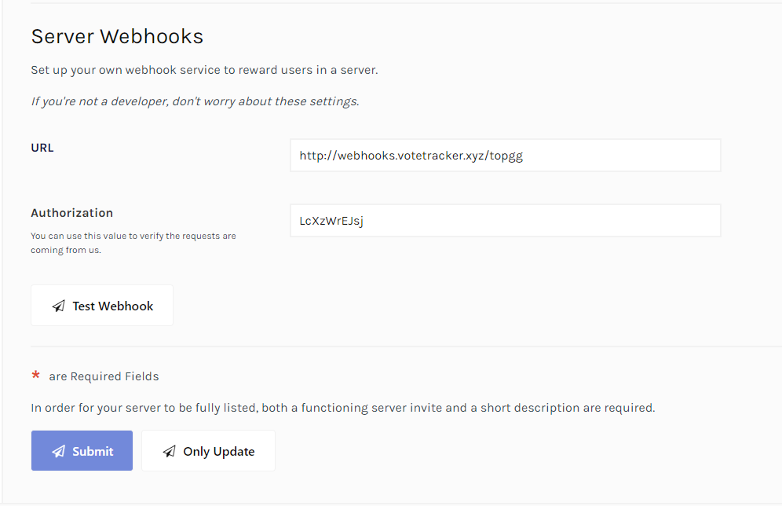
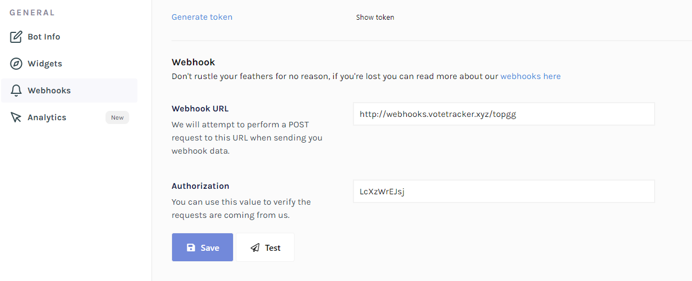

# Setup

## Step 1

Tell the bot what server or bot you want to track.  
To do this you use the command `vt!setup <guild id or bot id>`


 Your id can be found in your top.gg link

Example: [https://top.gg/bot/702134514637340702](https://top.gg/bot/702134514637340702). The id would be 702134514637340702


## Step 2

Set up the bots configuration. To find more information about this take a look at the [Config](config.md#usage) page.

## Step 3

Now you need to update the data on top.gg so we receive data about your votes. For this you go to your pages edit page.


You can find your edit page by adding `/edit` after the url of your top.gg page


### Guilds

For guilds the webhook edit page looks like this. You can find the URL and your Authorization code by doing `vt!setup`

## Bots

For guilds the webhook edit page looks like this. You can find the URL and your Authorization code by doing `vt!setup`

